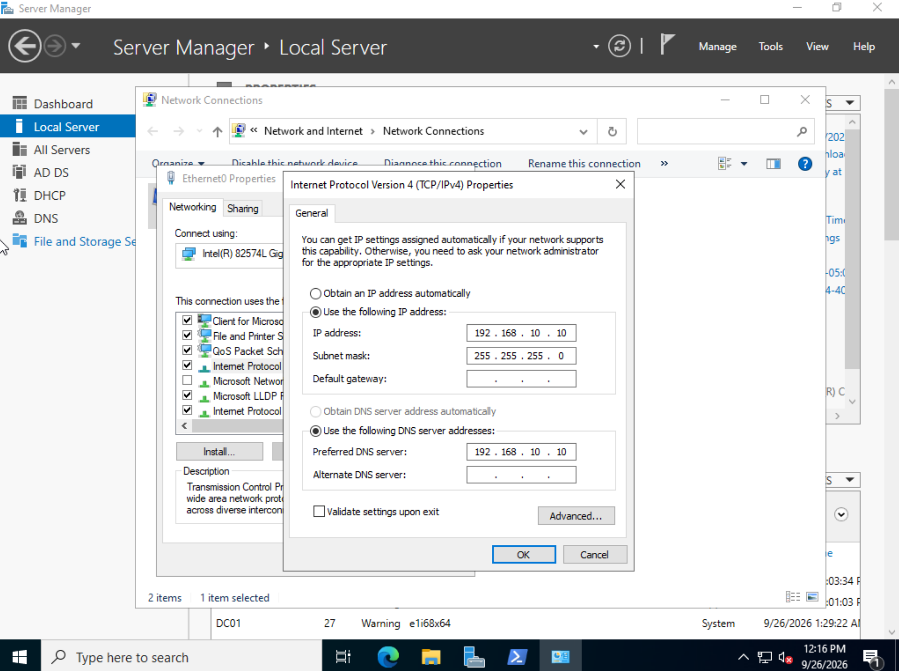
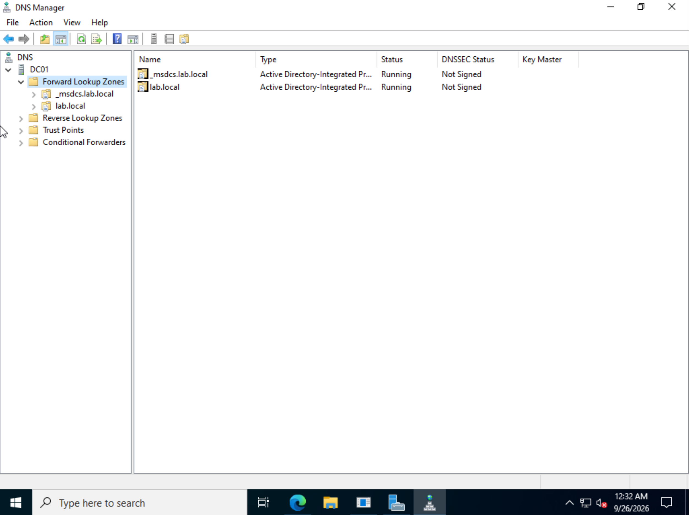
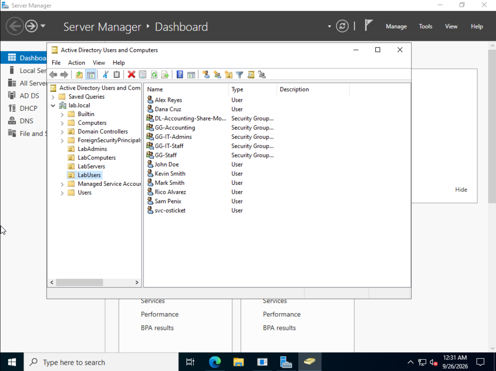
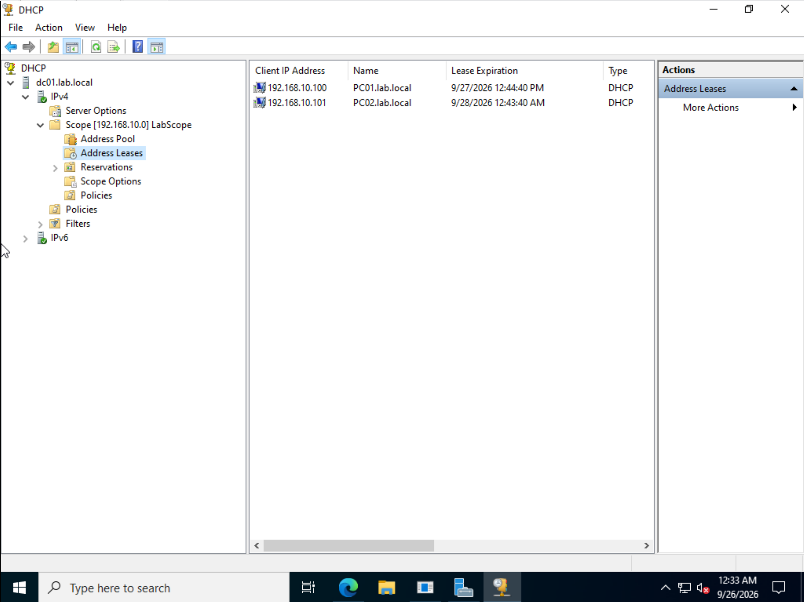
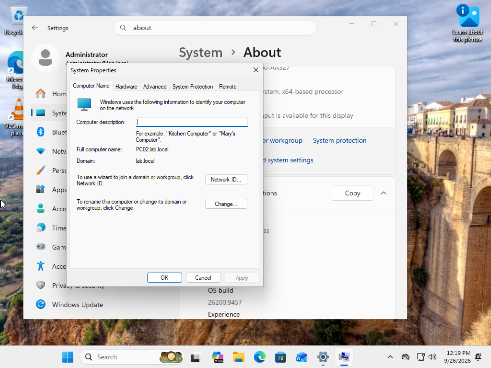
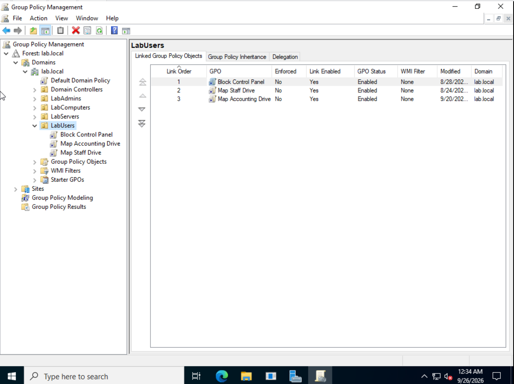
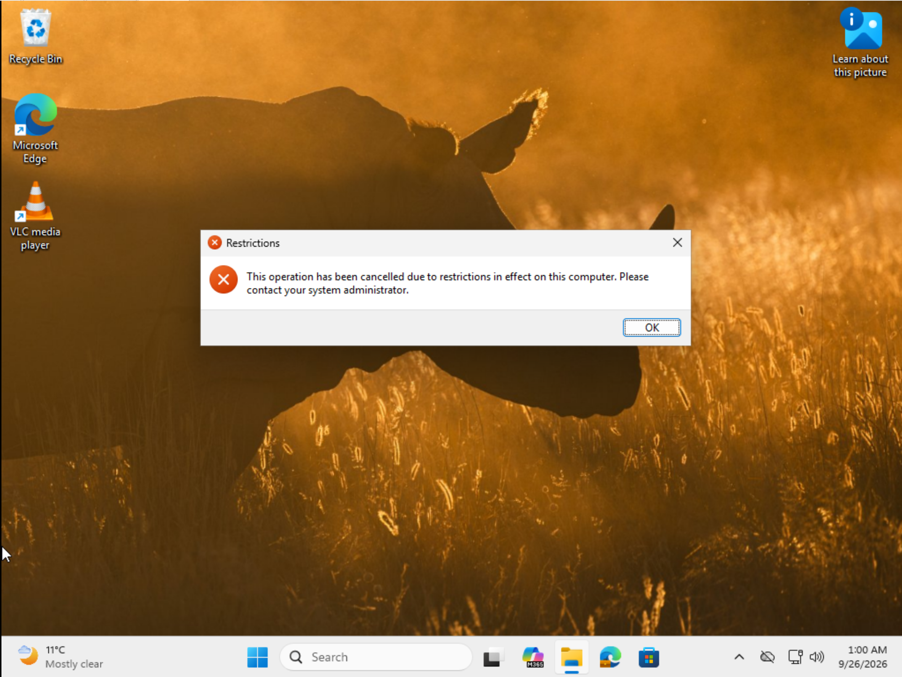
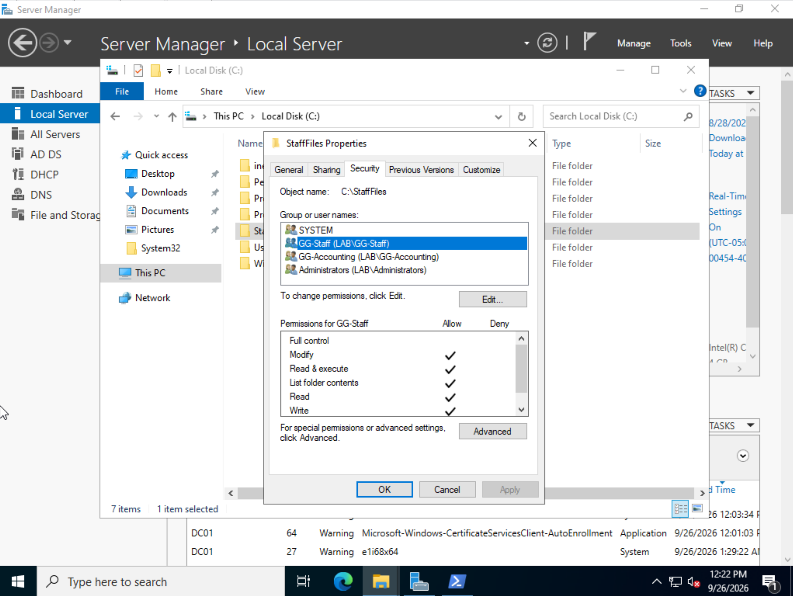
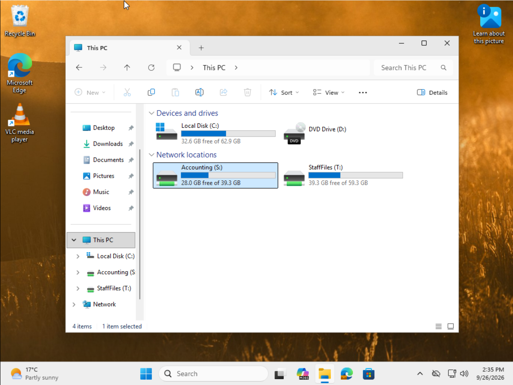

# Lab 01: Active Directory Domain Foundation

A Windows Server 2022 domain controller running AD DS, DNS and DHCP for a small simulated company, with two domain-joined Windows 11 workstations managed through Group Policy. Every other lab in this repo is built on top of this domain.

---

## Environment

| Machine | Role | OS | IP address |
|---|---|---|---|
| DC01 | Domain controller, DNS, DHCP | Windows Server 2022 | 192.168.10.10 (static) |
| PC01 | Workstation | Windows 11 Pro | 192.168.10.100 (DHCP) |
| PC02 | Workstation | Windows 11 Pro | 192.168.10.101 (DHCP) |

- **Hypervisor:** VMware Workstation Pro
- **Lab network:** isolated LAN segment, 192.168.10.0/24
- **Domain:** lab.local (NetBIOS name LAB)

---

## What I built

### 1. Domain controller

DC01 was given a static IP with DNS pointing at itself, then promoted to the first domain controller in a new forest, lab.local.

*DC01 IPv4 settings: static 192.168.10.10 /24, preferred DNS set to its own address.*

Installing AD DS created Active Directory-integrated DNS zones for the domain.

*DNS Manager on DC01: AD-integrated zones for lab.local and _msdcs.lab.local, both running.*

### 2. OU structure, users and groups

I created custom OUs instead of using the built-in Users and Computers containers, because Group Policy cannot be linked to those default containers.

| OU | Purpose |
|---|---|
| LabUsers | Staff user accounts and security groups |
| LabComputers | Workstations (target for computer policies) |
| LabServers | Member servers |
| LabAdmins | Administrative accounts |

Starting accounts were **jdoe** (John Doe) and **spenix** (Sam Penix), with a global security group **GG-Staff** for file share access. Later labs added more accounts and groups to LabUsers, which is why the screenshot below shows more than the original two users.

*Active Directory Users and Computers: custom OUs under lab.local and the contents of LabUsers.*

### 3. DHCP

The DHCP role was installed on DC01 and authorized in Active Directory. Scope **LabScope** hands out 192.168.10.100 to 192.168.10.200, with DC01 set as the DNS server so clients can find the domain.

*DHCP console: PC01 and PC02 holding leases from LabScope.*

### 4. Domain-joined workstations

PC01 and PC02 were joined to lab.local after confirming they could resolve and reach DC01.

*System Properties on PC02: full computer name PC02.lab.local, domain lab.local.*

### 5. Group Policy

Three user policies are linked to the LabUsers OU.

| GPO | What it does |
|---|---|
| Block Control Panel | Prevents standard users from opening Control Panel and Settings |
| Map Staff Drive | Maps T: to \\\\DC01\\StaffFiles at sign-in (moved from S:, see Troubleshooting) |
| Map Accounting Drive | Added in Lab 04, maps S: to \\\\FS01\\Accounting for GG-Accounting members |

*Group Policy Management: three GPOs linked to LabUsers, all enabled.*

I tested the Control Panel restriction by signing in as jdoe on PC02 and trying to open it.

*jdoe on PC02 gets the "restrictions in effect" message. The policy is working.*

### 6. File share with NTFS permissions

A shared folder, **StaffFiles**, was created on DC01. I disabled inheritance and removed the broad Users group so only named security groups have access, then mapped it as a network drive through Group Policy.

*StaffFiles Security tab: GG-Staff has Modify, and GG-Accounting was also granted access. The built-in Users group has been removed, so only these named groups (plus SYSTEM and Administrators) can open the folder.*

*jdoe's mapped network drives after the fix: Accounting on S: and StaffFiles on T:.*

---

## Troubleshooting

**VirtualBox networking failure.** The lab started on VirtualBox, but the VMs could not reach each other on an internal network. I worked through driver repairs, a reinstall, Smart App Control, firewall changes and several network modes without fixing it. I moved the lab to VMware Workstation Pro, set up a LAN segment for the lab network, and VM-to-VM traffic worked straight away. Knowing when to stop fighting a tool is part of troubleshooting.

**Two drive maps fighting over one letter.** Map Staff Drive and the later Map Accounting Drive (Lab 04) both used S:. jdoe is in both groups, so only one drive could show, and StaffFiles disappeared. I moved StaffFiles to T: in the GPO's Drive Maps preference.

**Then both drives disappeared.** Fixing the letter uncovered two more problems:

- **A typo in the path.** The StaffFiles drive map pointed to `\DC01\StaffFiles` with one backslash at the start instead of two, so Windows did not treat it as a network share. Corrected to `\\DC01\StaffFiles`.
- **Clocks out of sync.** `gpresult /r` showed user policy had last applied hours earlier, and `gpupdate /force` reported that the computer's clock did not match the domain controller. Active Directory sign-in (Kerberos) only allows about 5 minutes of difference, so the PC could not pull fresh policy or open the shares.

**The time fix.** I made DC01 the authoritative clock for the domain, syncing from an external time server with `w32tm /config /manualpeerlist:"time.windows.com,0x8" /syncfromflags:manual /reliable:yes /update`. Then I pointed every other machine at the domain hierarchy with `w32tm /config /syncfromflags:domhier /update`, restarted the Windows Time service, and forced a resync. After `gpupdate /force` and a fresh sign-in, jdoe had both S: and T:.

**What I took from it:** one visible symptom (missing drives) had three separate causes. `gpresult` and the exact `gpupdate` error message pointed straight at the real one.

**Naming mistake.** An early VM was named `DCO1` (letter O) instead of `DC01` (zero). Commands kept failing in confusing ways until I spotted it. This is a small example of why naming standards matter.

---

## Honest notes

- **File share on a domain controller.** StaffFiles lives on DC01. That was fine for a first lab, but in a real environment you keep extra roles off domain controllers. In Lab 04 I built a dedicated file server, FS01, and set up shares there using the AGDLP group model.
- **Single domain controller.** There is no second DC, so there is no redundancy. A production domain would have at least two.

---

## Skills demonstrated

- Installing and promoting a Windows Server 2022 domain controller
- AD-integrated DNS and DHCP scope configuration
- OU design and security groups
- Joining Windows 11 clients to a domain
- Creating, linking and testing Group Policy Objects
- NTFS permissions and GPO drive mapping
- Methodical troubleshooting of virtual networking
- Diagnosing Group Policy with gpresult and fixing domain time sync

---

## Next steps

- Enable the AD Recycle Bin
- Monitor time sync across the domain with `w32tm /monitor`
- Add a second domain controller
- Create users in bulk with PowerShell
