# Lab 02: Hybrid Identity with Microsoft Entra ID and Intune

This lab connects the on-premises lab.local domain from [Lab 01](../01-active-directory) to a Microsoft 365 tenant. Users sync to the cloud with Microsoft Entra Connect Sync, workstations are hybrid joined and auto-enrolled into Intune, and devices are managed with compliance policies, configuration profiles and app deployment. This is the hybrid setup most established companies run.

---

## Environment

| Component | Details |
|---|---|
| SYNC01 | Windows Server 2022 member server (not a DC), 192.168.10.20, plus a NAT adapter for internet |
| Sync tool | Microsoft Entra Connect Sync 2.6.84.0 |
| Tenant | `<tenant>.onmicrosoft.com`, Microsoft 365 Business Premium trial |
| Admin accounts | Cloud-only Global Admin for the tenant, kept separate from the on-prem domain admin |
| Managed devices | PC01 and PC02 (Windows 11 Pro) |

---

## What I built

### 1. Entra Connect Sync on a dedicated server

I installed Entra Connect Sync on its own member server instead of the domain controller, to keep extra software off the DC.

| Setting | Choice |
|---|---|
| Sign-in method | Password Hash Sync |
| Source anchor | mS-DS-ConsistencyGuid |
| Cloud username | userPrincipalName |
| Seamless SSO | Off |
| Staging mode | Off |
| Writeback (password, device, group, user) | Off |
| Auto upgrade | On |
| Database | SQL LocalDB |

The sync service authenticates to the tenant with an application and certificate that Entra Connect manages and rotates automatically.

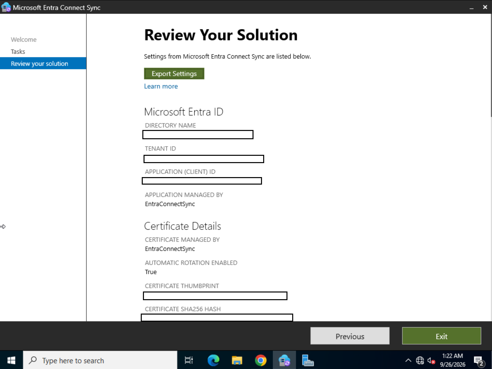
*Entra Connect Sync: connected to the tenant, certificate managed by the sync tool with automatic rotation on.*

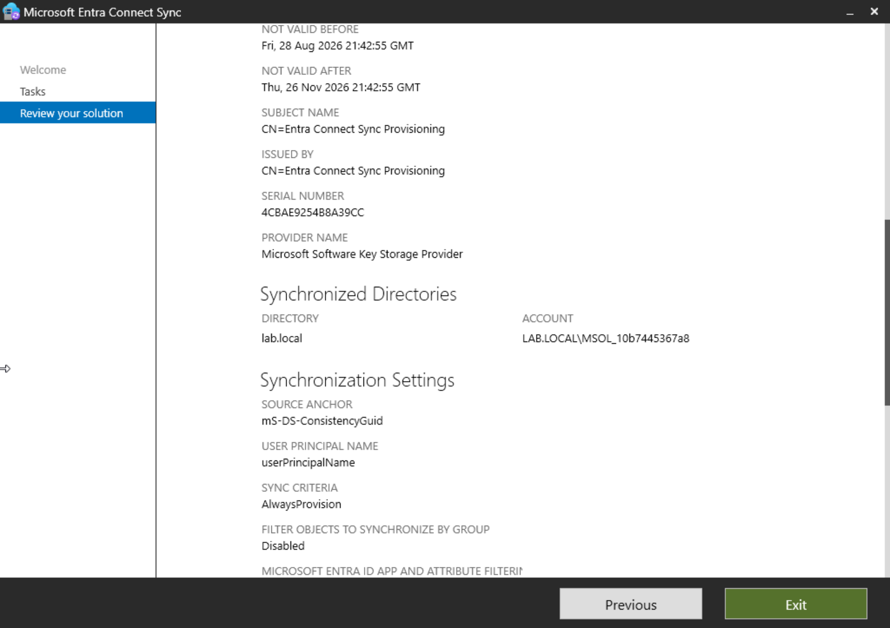
*Syncing the lab.local directory, source anchor mS-DS-ConsistencyGuid, sign-in name from userPrincipalName.*

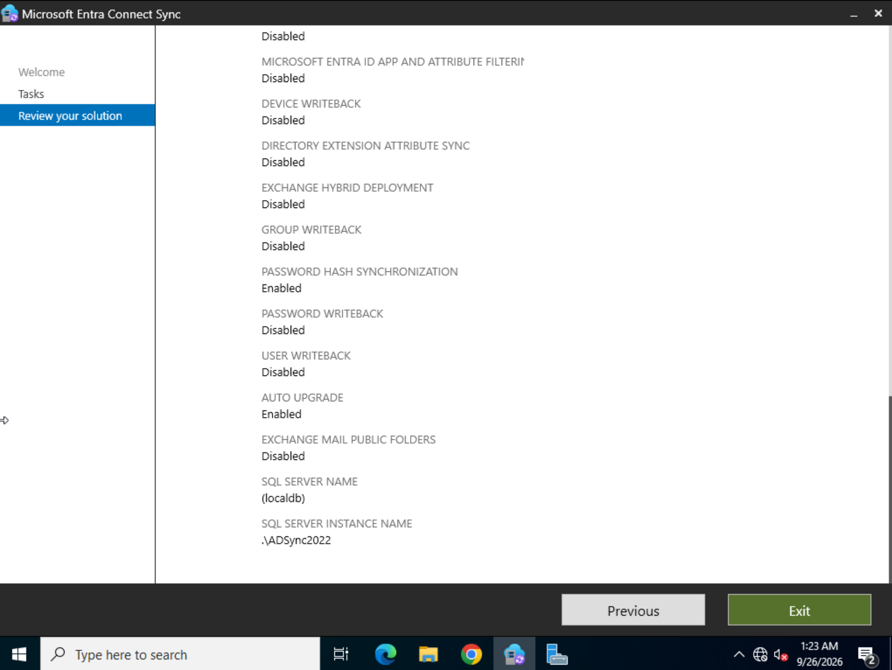
*Password Hash Sync enabled, writeback features off, auto upgrade on.*

### 2. User onboarding

jdoe and spenix synced from Active Directory into Entra ID. Each was licensed with Microsoft 365 Business Premium, signed in to Outlook, and registered for MFA. I onboarded spenix as a new-hire ticket to practice the real process end to end.

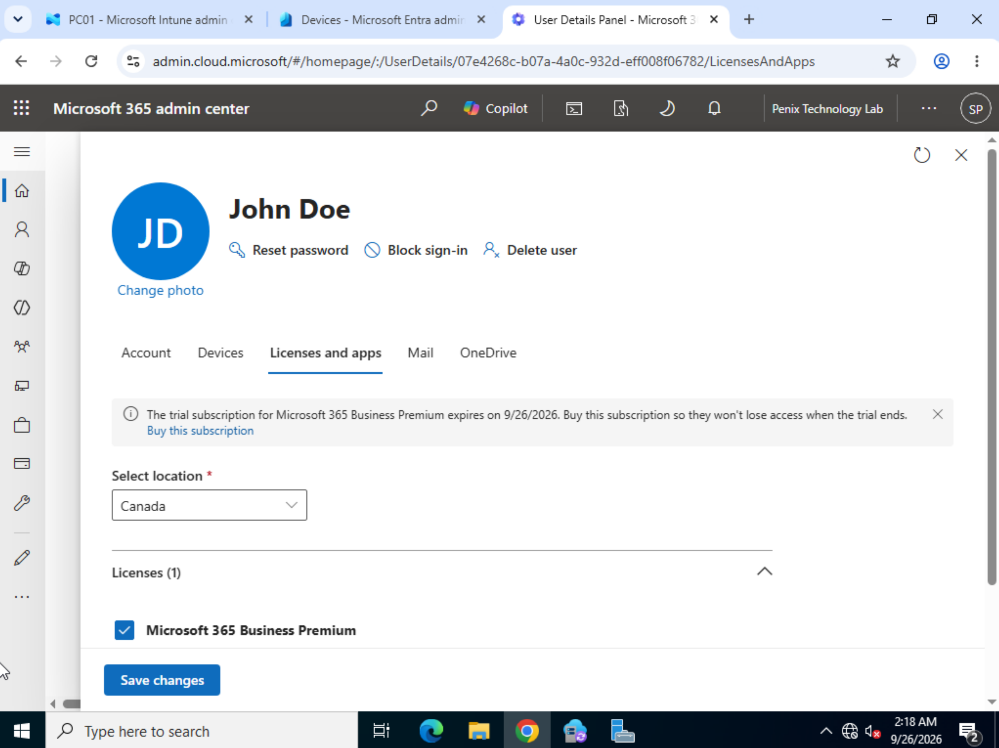
*Microsoft 365 admin center: John Doe licensed with Microsoft 365 Business Premium.*

### 3. Hybrid join and Intune auto-enrollment

A GPO named **Intune Auto Enrollment** is linked to the LabComputers OU. Workstations in that OU hybrid join to Entra ID and then enroll themselves in Intune.

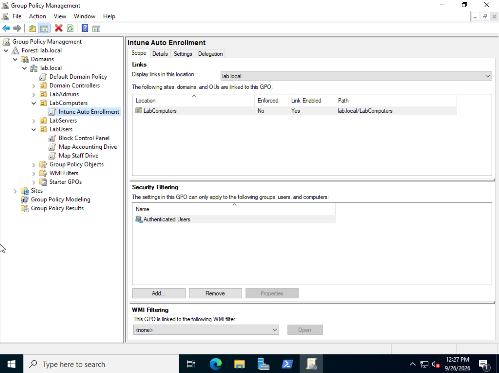
*Group Policy Management: Intune Auto Enrollment linked to LabComputers only.*

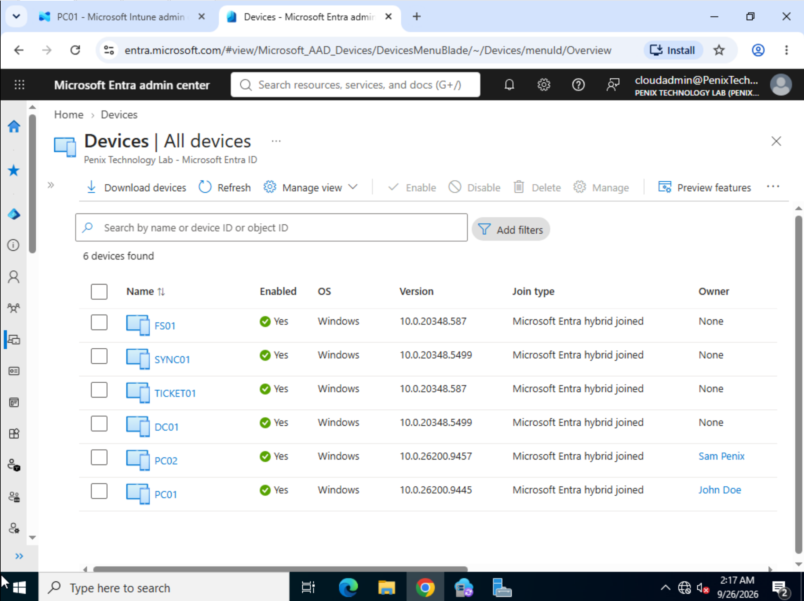
*Entra admin center: all six domain machines show as Microsoft Entra hybrid joined.*

All six domain-joined machines are hybrid joined, including the servers, because they are all in sync scope. Only PC01 and PC02 are enrolled in Intune, because the enrollment GPO is scoped to LabComputers. That split is deliberate: servers are known to the cloud but not managed by Intune.

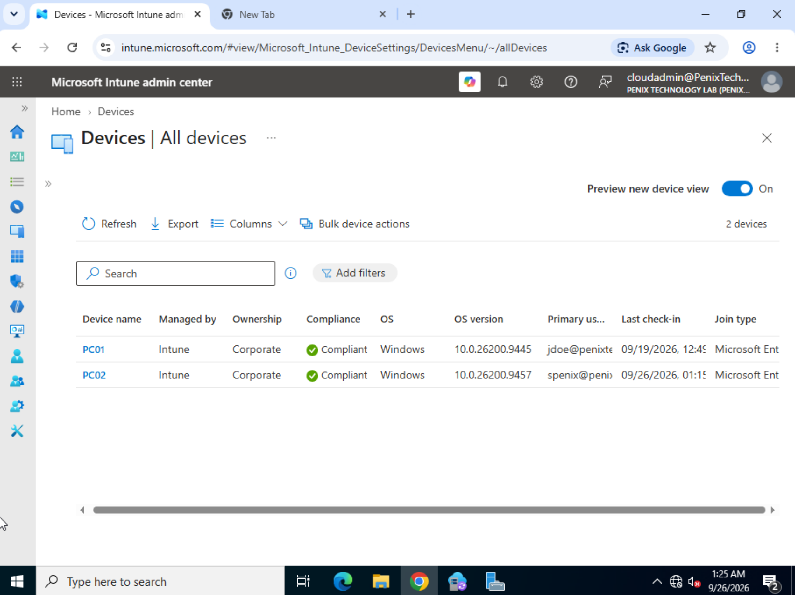
*Intune admin center: PC01 and PC02 managed by Intune, corporate owned and compliant.*

### 4. Pilot group

Instead of assigning policies to every device, I created a pilot group, **PILOT - Intune Devices**. I started with PC01 only and added PC02 once the first policies worked. This is how changes are rolled out safely in a real environment.

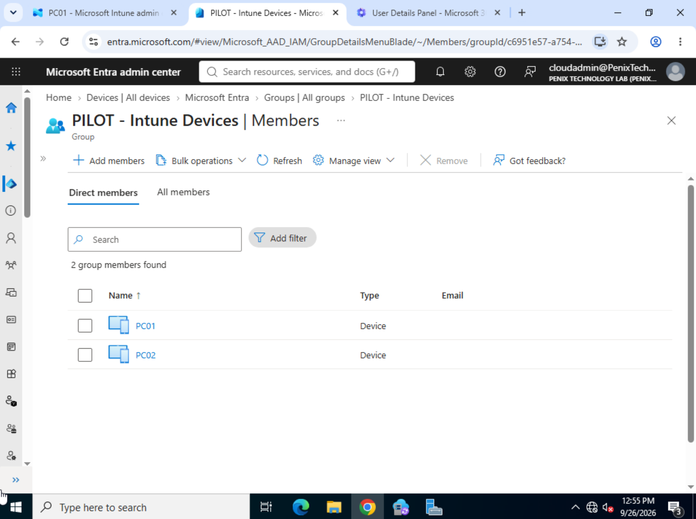
*Entra admin center: PC01 and PC02 as members of the pilot group.*

### 5. Compliance policy

**Win - Baseline Compliance (Pilot)** requires the firewall and antivirus to be on. I left out BitLocker, TPM and Secure Boot on purpose, because the VMs do not have that hardware and would be marked noncompliant for reasons that have nothing to do with the policy being tested.

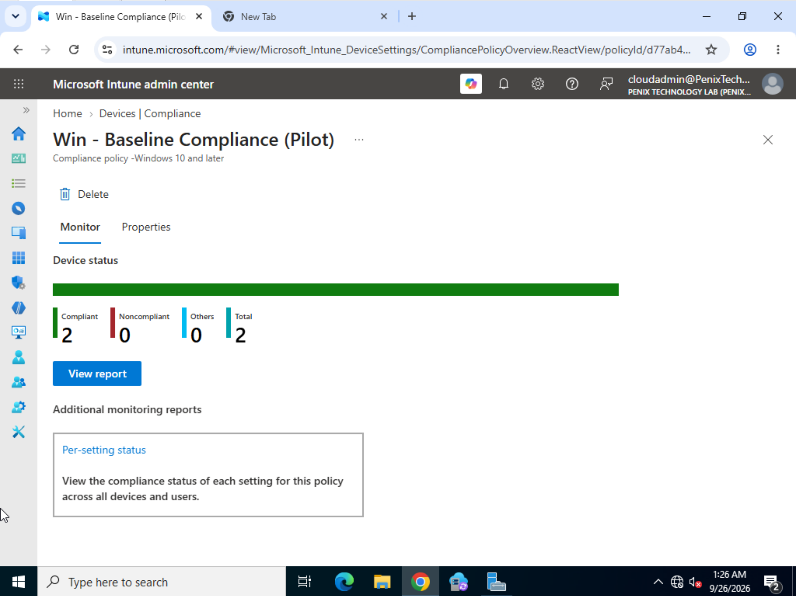
*Compliance policy: 2 of 2 devices compliant.*

### 6. Configuration profile

**Win - Screen Lock 15min (Pilot)** was built in the Settings Catalog. Setting Max Inactivity Time Device Lock to 15 minutes automatically pulled in Device Password Enabled as a required dependency.

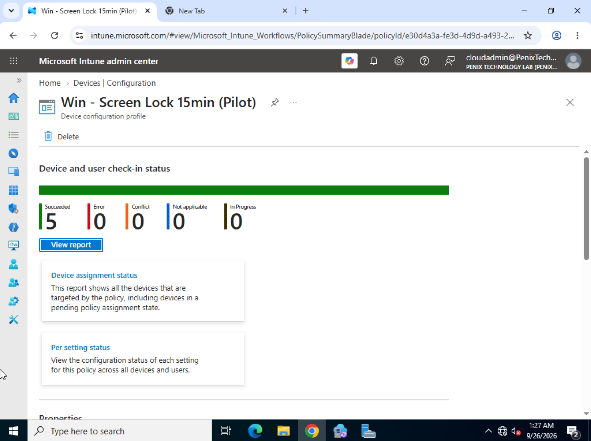
*Configuration profile: 5 succeeded, 0 errors.*

The count is 5, not 2, because Intune records separate check-ins for each device and for each user who signs in to it.

### 7. App deployment

VLC media player was deployed as a **Required** app to the pilot group using the Microsoft Store app (new) type.

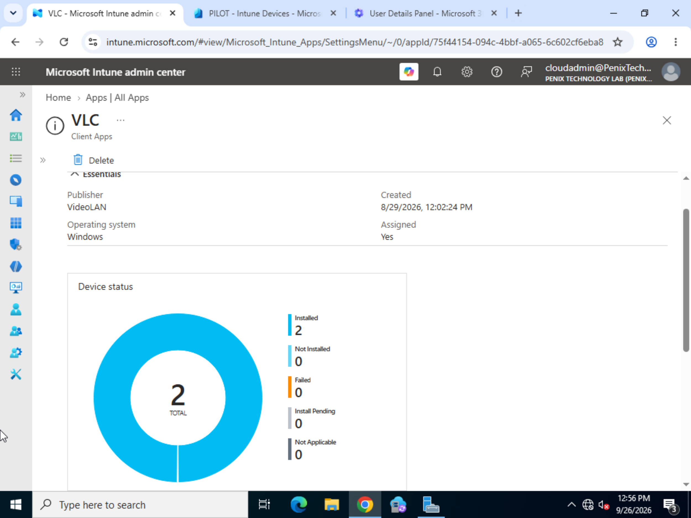
*Intune app status: VLC installed on 2 of 2 devices, 0 failed.*

### 8. Device record

After changing PC02's primary user from jdoe to spenix, the "Enrolled by" and "Management name" fields still showed jdoe. These fields are a record of who enrolled the device and do not change afterwards.

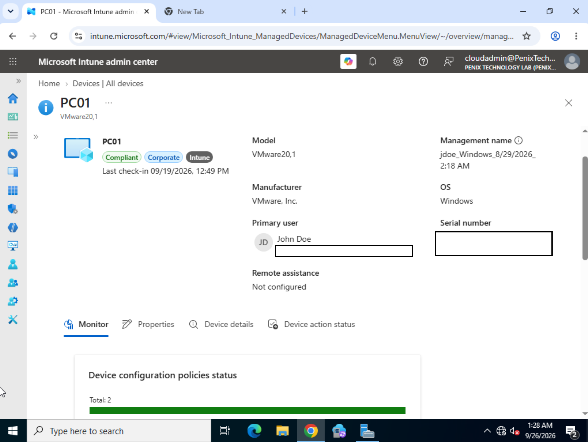
*PC01 in Intune: compliant, corporate owned, managed by Intune, primary user John Doe.*

---

## Troubleshooting

- **Slow first evaluation.** After assigning the first compliance policy, the report showed 0 devices for a while even though the assignment and group membership were correct. The first evaluation cycle is slow, and waiting was the fix.
- **App creation error.** Adding VLC failed once with an AjaxError. Retrying the same steps worked.
- **Spare laptop blocked.** I tried to Entra join a physical laptop, but it runs Windows Home, which has no option to join Entra ID. That needs Pro, Enterprise or Education. The laptop is parked until it has a Pro licence.

---

## Honest notes

- **Trial licence.** The Business Premium trial ran out on 9/26/2026. Screenshots were taken before it expired.
- **Classic sync tool.** Microsoft now recommends Entra Cloud Sync for new deployments. I used Entra Connect Sync because it is still very common in existing environments. Cloud Sync is a planned follow-up.
- **No hardware security in VMs.** There is no vTPM on the VMs, so the compliance baseline does not check encryption. A production baseline would require BitLocker.
- **No Conditional Access yet.** MFA is registered, but no Conditional Access policies have been built.

---

## Skills demonstrated

- Hybrid identity with Entra Connect Sync and Password Hash Sync
- Microsoft 365 licensing and user onboarding with MFA
- Hybrid Entra join and GPO-based Intune auto-enrollment
- Pilot-group rollout of Intune policies
- Compliance policies and Settings Catalog configuration profiles
- Required app deployment through Intune
- Reading Intune reports and device records correctly

---

## Next steps

- Conditional Access policies in report-only mode
- Intune remote actions (sync, restart, wipe on a test device)
- Try Entra Cloud Sync alongside the classic tool
- Entra join the spare laptop once it has Windows Pro
