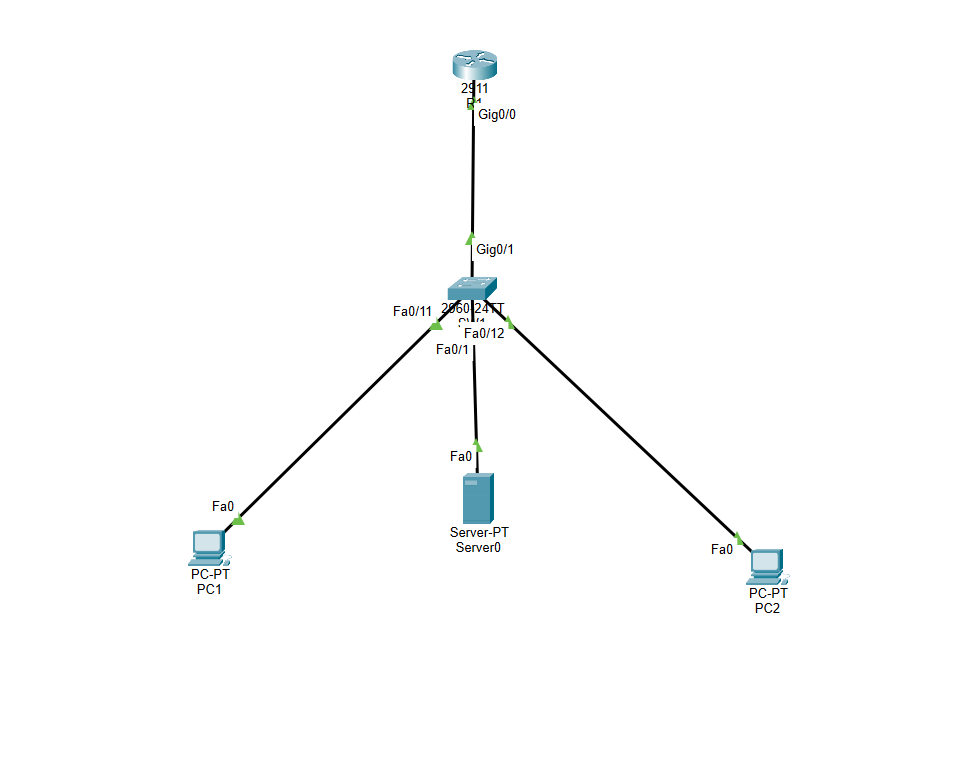
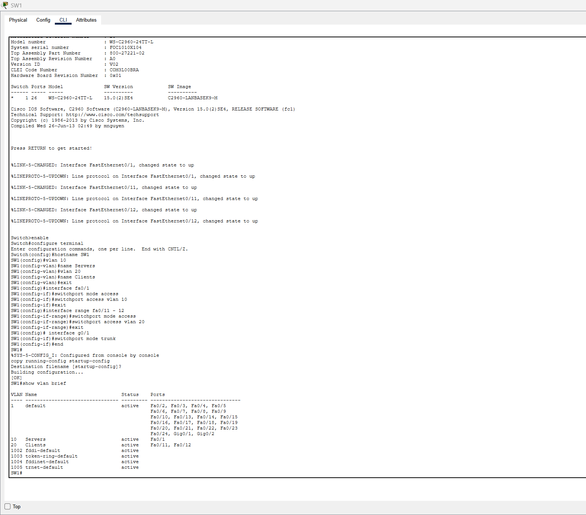
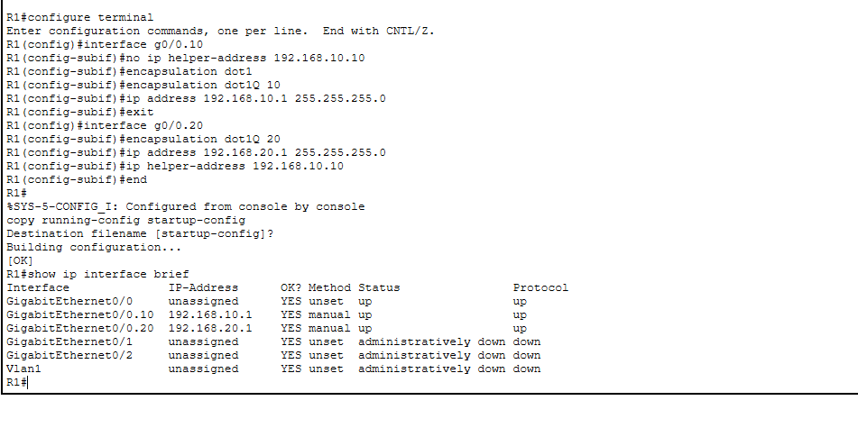
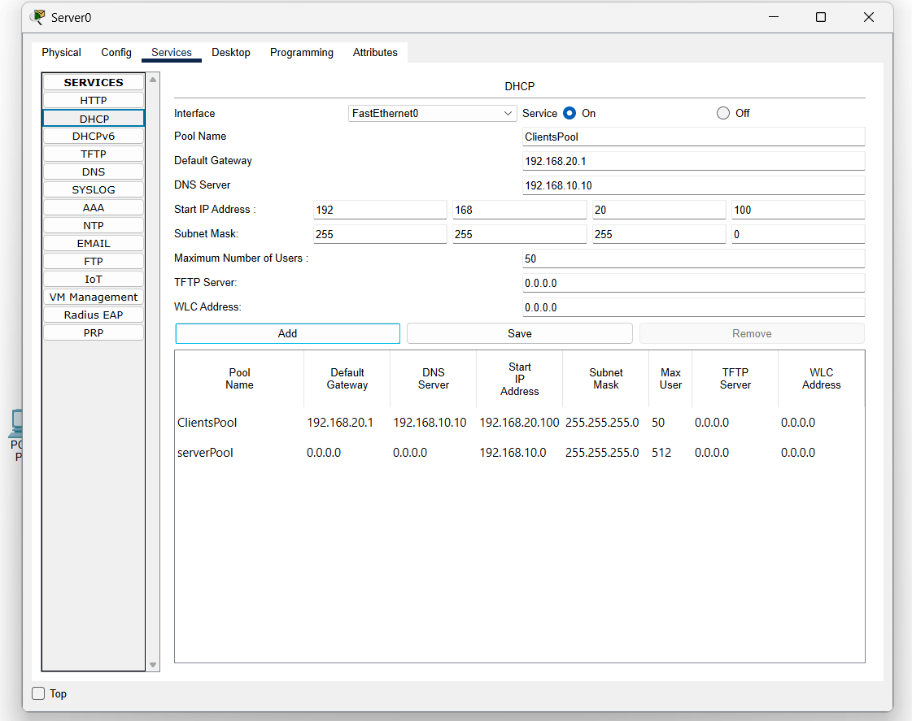
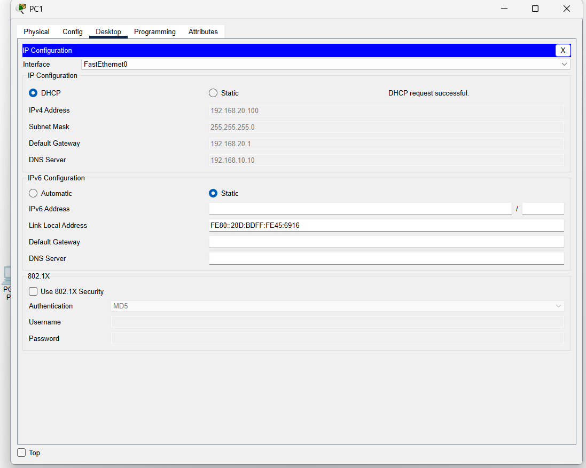
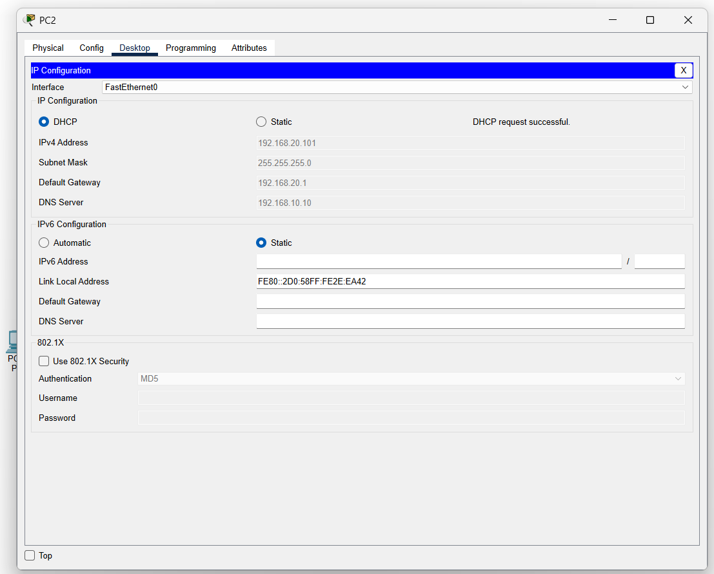
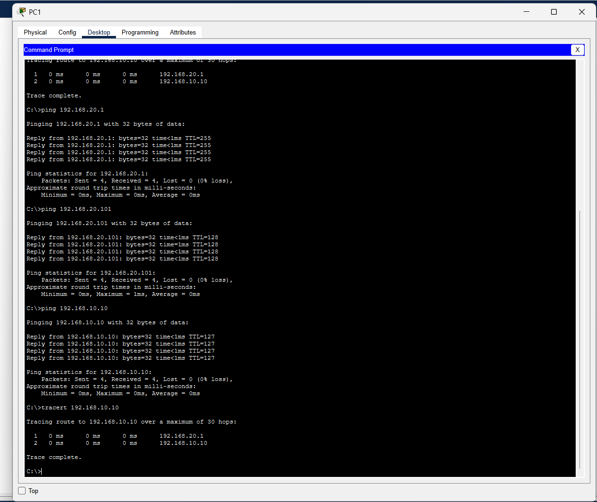
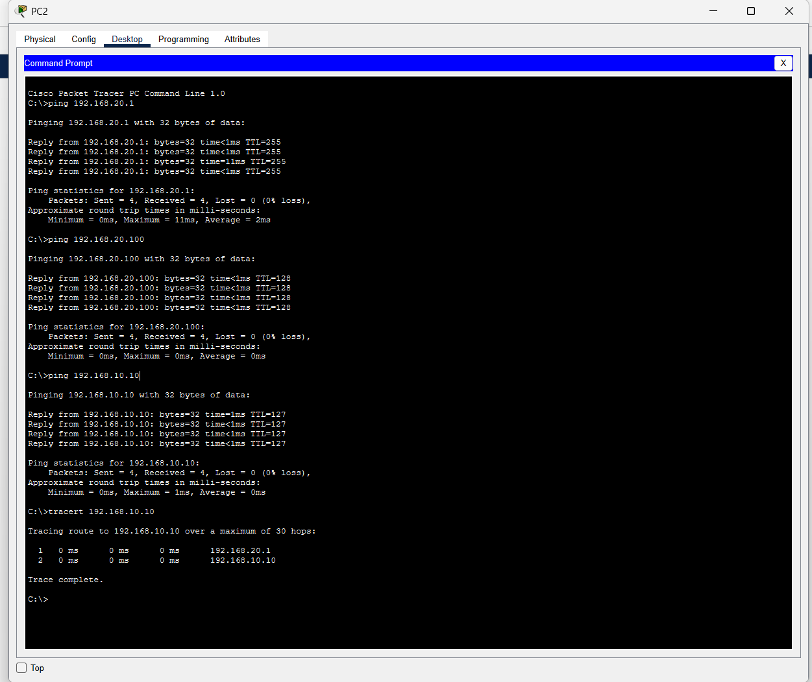
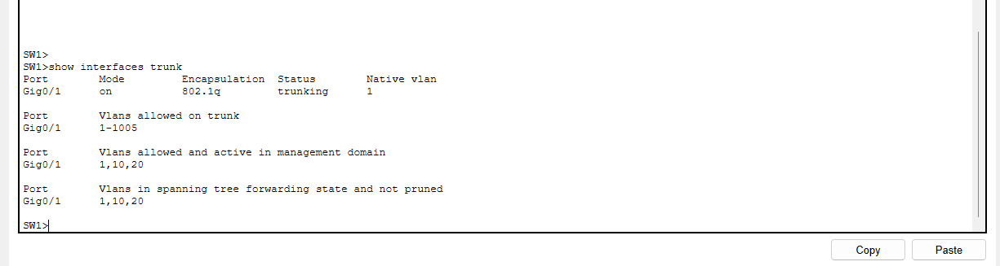

# Lab 03: Inter-VLAN Routing and DHCP Relay (Cisco Packet Tracer)

A small network built in Cisco Packet Tracer that splits one switch into two VLANs, routes between them with a single router port (router-on-a-stick), and hands out IP addresses from a server in a different VLAN using DHCP relay. The addressing mirrors the rest of this home lab, where the server VLAN matches the 192.168.10.0/24 network that DC01 lives on.

The Packet Tracer file is included: [`lab03-inter-vlan.pkt`](lab03-inter-vlan.pkt)

---

## Topology


*One router, one switch, a server and two PCs, with port labels shown. Every link is green, meaning all ports are up.*

| Device | Model | Role | Address |
|---|---|---|---|
| R1 | Cisco 2911 router | Routes between VLANs, relays DHCP | 192.168.10.1 and 192.168.20.1 |
| SW1 | Cisco 2960 switch | Splits ports into VLANs, trunks to R1 | |
| Server0 | Server | DHCP server (plays the role of DC01) | 192.168.10.10 (static) |
| PC1 | PC | Client | 192.168.20.100 (DHCP) |
| PC2 | PC | Client | 192.168.20.101 (DHCP) |

| VLAN | Name | Network | Gateway | Switch ports |
|---|---|---|---|---|
| 10 | Servers | 192.168.10.0/24 | 192.168.10.1 | Fa0/1 |
| 20 | Clients | 192.168.20.0/24 | 192.168.20.1 | Fa0/11, Fa0/12 |

| Link | From | To |
|---|---|---|
| Trunk | R1 G0/0 | SW1 G0/1 |
| Access | Server0 | SW1 Fa0/1 |
| Access | PC1 | SW1 Fa0/11 |
| Access | PC2 | SW1 Fa0/12 |

---

## What I built

### 1. VLANs on the switch

Created VLAN 10 (Servers) and VLAN 20 (Clients), put each port in its VLAN as an access port, and set the uplink to the router as a trunk so it carries both VLANs.

```
vlan 10
 name Servers
vlan 20
 name Clients
interface fa0/1
 switchport mode access
 switchport access vlan 10
interface range fa0/11 - 12
 switchport mode access
 switchport access vlan 20
interface g0/1
 switchport mode trunk
```


*`show vlan brief`: Fa0/1 in VLAN 10, Fa0/11 and Fa0/12 in VLAN 20.*

### 2. Router-on-a-stick

The router has one cable to the switch. I split that port into two subinterfaces, one per VLAN, each tagged with 802.1Q and given the gateway address for its VLAN.

```
interface g0/0
 no shutdown
interface g0/0.10
 encapsulation dot1Q 10
 ip address 192.168.10.1 255.255.255.0
interface g0/0.20
 encapsulation dot1Q 20
 ip address 192.168.20.1 255.255.255.0
 ip helper-address 192.168.10.10
```


*Both subinterfaces up/up with their gateway addresses, and the configuration saved.*

### 3. DHCP across VLANs

The server has a static address in VLAN 10 and runs a DHCP pool for VLAN 20. A DHCP request is a broadcast, and broadcasts do not cross a router on their own. The `ip helper-address 192.168.10.10` line on the VLAN 20 subinterface makes the router forward those requests to the server as normal traffic. This is the same way a domain controller hands out addresses to many VLANs in a real company.

| Pool | Gateway | DNS | Start address | Mask | Max users |
|---|---|---|---|---|---|
| ClientsPool | 192.168.20.1 | 192.168.10.10 | 192.168.20.100 | 255.255.255.0 | 50 |


*Server0 DHCP service on, with ClientsPool for VLAN 20.*


*PC1 got 192.168.20.100 from a server in a different VLAN, with the correct gateway and DNS.*


*PC2 got the next address, 192.168.20.101, from the same pool.*

---

## Testing

I ran the same four tests from both PCs.


*From PC1: ping the gateway, ping PC2, ping the server, and tracert to the server.*


*The same tests from PC2, all passing.*

| Test | Result from both PCs | What it proves |
|---|---|---|
| Ping gateway 192.168.20.1 | 4/4 replies, TTL=255 | Each PC reaches its gateway on the router |
| Ping the other PC | 4/4 replies, TTL=128 | Same-VLAN traffic works at the switch |
| Ping Server0 192.168.10.10 | 4/4 replies, TTL=127 | Traffic crosses VLANs through the router |
| tracert to Server0 | 2 hops: 192.168.20.1, then 192.168.10.10 | The router is the path between VLANs |

The TTL values tell a small story on their own. Each device starts its replies with a default TTL, 255 for the Cisco router and 128 for Windows-style hosts, and every router a packet passes through lowers it by one. The other PC answers with 128 because nothing routed the reply. The server answers with 127, which shows its reply crossed exactly one router on the way back.


*`show interfaces trunk`: G0/1 trunking with 802.1Q, VLANs 1, 10 and 20 active and forwarding.*

---

## Troubleshooting

**Commands landed on the wrong subinterface.** On the first attempt I typed a block of router commands without waiting for each prompt. The router printed "changed state to up" messages in the middle, a few lines were lost, and the VLAN 10 subinterface ended up with VLAN 20's encapsulation, IP address and helper address, while the VLAN 20 subinterface was never created. I caught it by reading the output back line by line, then corrected G0/0.10 and built G0/0.20 again, one command at a time.

**The save did not happen.** `copy running-config startup-config` asks for a destination file name. I typed my next command into that prompt, so the save failed with an error. The fix is to just press Enter to accept the default. The lucky side effect was that the wrong configuration never got saved.

**Lesson:** read the prompt before typing the next line. On a real device, `logging synchronous` on the console line stops log messages from breaking up what you are typing.

---

## Honest notes

- **Simulation, not real hardware.** Packet Tracer models Cisco IOS closely but not perfectly. The next version of this lab is planned for physical Cisco equipment.
- **Security defaults left in place.** The native VLAN is still VLAN 1, the trunk allows every VLAN, unused switch ports are still active, and no passwords or SSH are set. This lab focused on routing and DHCP relay. A production network would lock all of these down.

---

## Skills demonstrated

- VLAN creation and access port assignment
- 802.1Q trunking
- Router-on-a-stick with subinterfaces
- DHCP relay with `ip helper-address`
- Verifying with `show vlan brief`, `show ip interface brief`, `show interfaces trunk`, ping and tracert
- Reading TTL values to tell how many routers a packet crossed
- Reading output carefully to catch and fix configuration mistakes

---

## Next steps

- Harden the switch: change the native VLAN, limit the trunk to VLANs 10 and 20, shut down unused ports, add port security
- Secure device access with passwords and SSH
- Add `logging synchronous` to the console lines
- Rebuild the lab on physical Cisco equipment
